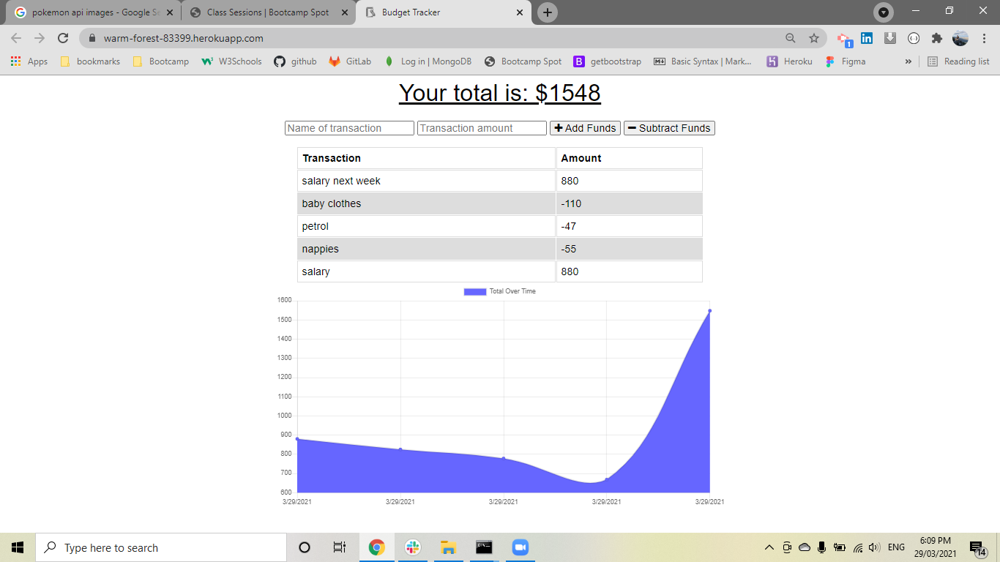

# online-offline-budget-trackers

* [links](#links)
* [Description](#description)
* [Built With](#builtwith)
* [Installation](#installation)
* [Screenshots](#screenshots)
* [Questions](#questions)

## links

    link of the repository :   https://github.com/pfotis/online-offline-budget-trackers
    
    link of the webpage  :     https://warm-forest-83399.herokuapp.com/

## Description

    This application store in the database mongoDB all the transactions from the user. The user could add new transactions 
    from different terminals. 

    The user could store all the spendings and all the earnings up to today. The application read all the data the user input, 
    and for better look for the user create a diagram. The diagram help the user to see better his/her transactions history.
    Additional this application can work when the user is without internet connection , this happen because the application 
    create a temporary database in the browser until the user's divice go back online and all the stored data from browser delete
    automatically.

## Built With

    HTML
    Bootstrap
    CSS
    Javascript
    Node.js
    Expess.js
    MongoDB
    Mongoose

## Installation

    npm install

## Screenshots

    With the following pictures the user could see the outfit of this project.

## Questions

    For any questions about this repository, please contact me at pfotis@gmail.com
    View my work in GitHub pfotis(https://github.com/pfotis)